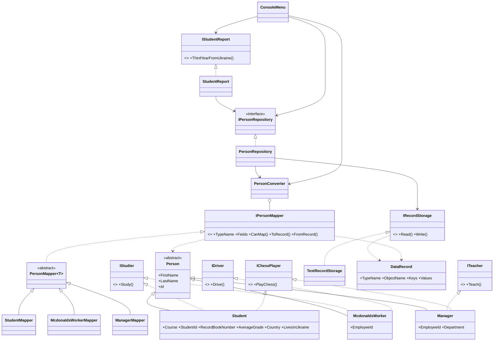

```mermaid
classDiagram
    class Person {
        <<abstract>>
        +FirstName
        +LastName
        +Id*
    }
    class Student { +Course +StudentId +RecordBookNumber +AverageGrade +Country +LivesInUkraine }
    class McdonaldsWorker { +EmployeeId }
    class Manager { +EmployeeId +Department }
    class IStudier { <<interface>> +Study() }
    class ITeacher { <<interface>> +Teach() }
    class IDriver { <<interface>> +Drive() }
    class IChessPlayer { <<interface>> +PlayChess() }
    Person <|-- Student
    Person <|-- McdonaldsWorker
    Person <|-- Manager
    IStudier <|.. Student
    IStudier <|.. McdonaldsWorker
    IDriver <|.. McdonaldsWorker
    ITeacher <|.. Manager
    IChessPlayer <|.. Student
    IChessPlayer <|.. Manager

    class IRecordStorage { <<interface>> +Read() +Write() }
    class TextRecordStorage
    class DataRecord { +TypeName +ObjectName +Keys +Values }
    IRecordStorage <|.. TextRecordStorage
    IRecordStorage ..> DataRecord

    class IPersonMapper { <<interface>> +TypeName +Fields +CanMap() +ToRecord() +FromRecord() }
    class PersonMapper~T~ { <<abstract>> }
    class StudentMapper
    class McdonaldsWorkerMapper
    class ManagerMapper
    class PersonConverter
    IPersonMapper <|.. PersonMapper
    PersonMapper <|-- StudentMapper
    PersonMapper <|-- McdonaldsWorkerMapper
    PersonMapper <|-- ManagerMapper
    PersonConverter o-- IPersonMapper
    IPersonMapper ..> Person
    IPersonMapper ..> DataRecord

    class IPersonRepository { <<interface>> }
    class PersonRepository
    class IStudentReport { <<interface>> +ThirdYearFromUkraine() }
    class StudentReport
    class ConsoleMenu
    IPersonRepository <|.. PersonRepository
    IStudentReport <|.. StudentReport
    PersonRepository --> IRecordStorage
    PersonRepository --> PersonConverter
    StudentReport --> IPersonRepository
    ConsoleMenu --> IPersonRepository
    ConsoleMenu --> IStudentReport
    ConsoleMenu --> PersonConverter
```
